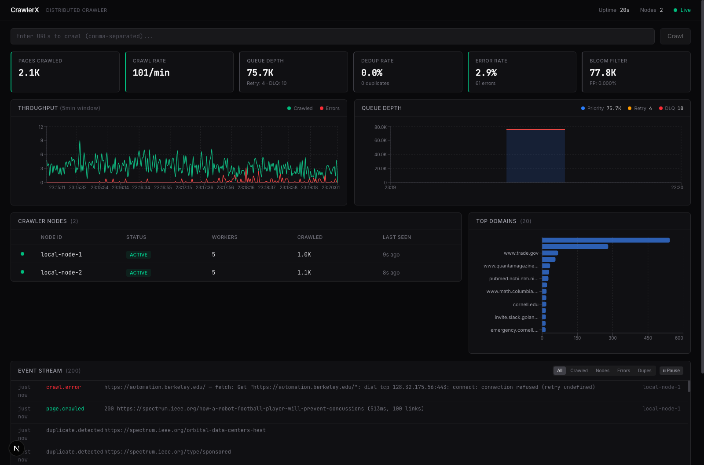
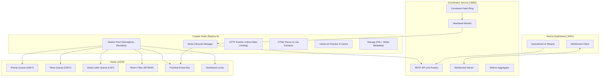
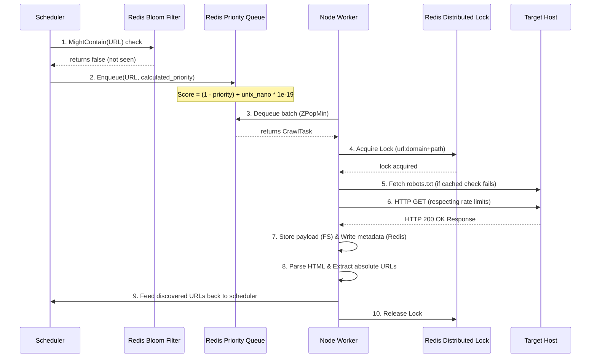

# CrawlerX

A production-grade, distributed web crawler built in Go and Next.js, featuring real-time monitoring, priority scheduling, Bloom filter deduplication, consistent hashing, and distributed locking.

## Problem

Web crawling at scale (millions of pages across arbitrary domains) presents significant distributed systems and engineering challenges:
1. **Deduplication at Scale**: Checking if a URL has already been visited must be fast and constant-time ($O(1)$) without exhausting RAM as the dataset grows.
2. **Politeness & Rate Limiting**: Crawlers must respect `robots.txt` directives and restrict request frequency per domain to avoid triggering Denial-of-Service (DoS) alarms or overloading target websites.
3. **Concurrency & Locking Collision**: In a distributed deployment, multiple node instances polling the same queue must not fetch the exact same URL concurrently, which leads to wasted bandwidth and duplicated data.
4. **Fault Tolerance & Reliability**: If a crawler node dies mid-crawl, the system must detect the failure, isolate the node, and retry failed operations with exponential backoff.
5. **Operational Visibility**: Operators require a real-time, low-latency dashboard showing queue depths, throughput spikes, live log streams, and cluster topology changes.

## Solution

CrawlerX implements a decoupled, event-driven, coordinator-worker architecture utilizing Go's native concurrency primitives and Redis as the shared cluster state repository.

* **Coordinator Service**: Coordinates node registration, monitors heartbeats, aggregates cluster metrics, and bridges internal Pub/Sub events to the browser dashboard via WebSockets.
* **Distributed Crawler Nodes**: Bounded worker pools running on separate machines or containers. Each node registers with the coordinator, runs a heartbeat ping loop, and continuously dequeues/processes URLs in parallel.
* **Shared Storage & Queue State**: Redis serves as the centralized orchestrator providing sorted set priority queues, atomic lua-scripted retry gates, bitmask Bloom filters, and distributed mutexes.

### Dashboard Preview



#### Technical Breakdown of the Dashboard Metrics & Console

The screenshot above captures a live, production run of CrawlerX with two active nodes crawling at scale. The interface is divided into functional widgets driven by the coordinator's metrics engine:

* **Cluster Status (Header)**:
  * **Uptime**: Tracks the duration of the coordinator service since startup (currently `20s` in the screenshot).
  * **Nodes**: Indicates the number of active physical nodes registered in the **Consistent Hash Ring** (showing `2` active nodes).
  * **Live Connection**: A green heartbeat status indicating that the UI is connected via WebSockets to the coordinator's event bus (`ws://localhost:8080/ws`).
* **KPI Metric Cards (System Health)**:
  * **Pages Crawled**: The total count of successfully crawled pages across all nodes (showing `2.1K` pages). Backed by the `crawlerx:metrics:crawled` Redis counter.
  * **Crawl Rate**: Computed over a rolling 60-second window, showing the overall throughput rate (crawling at `101 pages/min`).
  * **Queue Depth**: The current number of URLs awaiting processing in the priority sorted set (`75.7K` URLs). It also displays counts for tasks in **Retry backoff** (`4` tasks) and tasks relegated to the **Dead Letter Queue** (`10` tasks).
  * **Dedup Rate**: Shows the percentage of URLs that were identified as duplicates and bypassed (currently `0.0%` for this seed batch).
  * **Error Rate**: The ratio of network/DNS/HTTP errors to total crawl attempts (currently `2.9%` with `61 errors`).
  * **Bloom Filter occupancy**: Tracks total unique items added to the Redis Bloom Filter bitmap (showing `77.8K` unique URLs mapped) alongside the estimated false-positive rate ($FP \approx (1 - e^{-kn/m})^k = 0.000\%$).
* **Real-time Analytics Charts**:
  * **Throughput (5min window)**: A high-density line chart plotting successful crawls (green) versus crawl errors (red) per second.
  * **Queue Depth**: An area chart showing the trend of priority queue occupancy.
* **Top Domains (Distribution Bar Chart)**:
  * Renders the top 20 domains by crawl volume (e.g. `www.trade.gov`, `cornell.edu`), sourced directly from a Redis Sorted Set (`crawlerx:metrics:domains`) updated via `ZINCRBY` on every page parsed.
* **Crawler Nodes Registry (Table)**:
  * Tracks each physical worker node instance. It displays the **Node ID** (`local-node-1` and `local-node-2`), status (`ACTIVE`), number of worker routines executing (`5` workers each), pages crawled individually by that node (`1.0K` and `1.1K`), and last-seen heartbeat age (`9s` and `8s` ago).
* **Live Event Stream Feed**:
  * A scroll-bounded log viewer that streams events pushed via the WebSocket connection in real-time. Logs are color-coded by event types: `page.crawled` (green) showing status code and duration, `crawl.error` (red) displaying connection refuse or DNS lookup warnings, and `duplicate.detected` (gray) indicating Bloom filter matches.

## Architecture

The diagram below reflects the topology and operational loop of CrawlerX:



### URL Lifecycle & Processing Pipeline



## System Design Decisions

### Why Go Was Chosen
Go is used for the backend components due to its runtime efficiency, static compilation, and first-class concurrency primitives:
* **Goroutines & Channels**: Spin up thousands of lightweight threads costing only ~2KB of memory each.
* **Control of Parallelism**: Using `golang.org/x/sync/semaphore` allows configuring precise limits on concurrently executing fetches, preventing system resource starvation.
* **Static Binaries**: Compiling down to single dependency-free binaries results in minimal, high-security Docker images (~15MB).

### Why Redis Was Chosen
Redis functions as our single, multi-model cluster memory store:
* **Priority Queuing (ZSET)**: Handled natively via Redis Sorted Sets, avoiding the complexity of a bulkier broker like Kafka or RabbitMQ.
* **Atomicity**: Enables writing multi-command transactional sequences (via pipeline) and custom scripts (Lua) executed atomically on the server.
* **Low Latency**: Key lookup, Bloom bit manipulation, and lock operations happen in sub-millisecond speeds.

### Why Worker Pools Were Used
Spawning a fresh goroutine for every single page crawl would overwhelm network sockets and OS file descriptors. The worker pool restricts concurrency to a configurable limit (`CRAWLERX_WORKER_COUNT`) using a counting semaphore. Workers reuse TCP connections via a shared HTTP pool, maximizing throughput.

### Why Consistent Hashing Was Implemented
To track cluster capacity and support future sharding, the coordinator uses a **Consistent Hash Ring** with `150` virtual nodes per physical crawler node. This keeps node mapping highly stable: when crawler nodes scale up or down, the hash ring dynamically updates with minimal mapping reshuffling ($1/N$ keys shifted).

### Why Bloom Filters Were Used
Hashing millions of URLs to strings inside a standard Redis SET would exhaust gigabytes of memory. A bitmask Bloom filter maps elements to a shared byte string (bitmap) using double hashing. 
* **Formula**: For $10,000,000$ expected items and a $1\%$ false-positive rate, the filter requires only **~9.6 MB** of RAM and $7$ hash functions.
* **Double Hashing**: Implemented via $h_i(x) = (h_1(x) + i \cdot h_2(x)) \pmod m$, utilizing `hash/fnv` to calculate hash values without requiring cryptographic operations (like SHA-256).

### Why Distributed Locking Was Necessary
If two workers fetch page $A$ simultaneously, they might parse the same links and schedule duplicate tasks. To prevent duplicate concurrent crawls, we acquire a temporary lease on a Redis key `crawlerx:lock:url:<url_hash>` using `SetNX` with a `60-second` TTL. Clean release is guaranteed using a Lua script that verifies node ownership before deletion.

## Key Features

* **Real-time Dashboard**: Datadog/Grafana-inspired, Next.js 16/Tailwind CSS v4 console monitoring cluster status, events, and performance charts.
* **Respectful Crawler Node**: Honors `robots.txt` via cache-enabled check files (`github.com/temoto/robotstxt`) and enforces domain-based rate limits.
* **Self-Healing Cluster**: If a node crashes, the coordinator's heartbeat monitor detects the absence, updates the consistent hash ring, and marks the node inactive.
* **Exponential Backoff Retry**: Network drops are handled by moving failed tasks to a Redis-sorted retry queue with backoff calculation ($base \cdot 2^{retry\_count - 1}$), moving persistently failing URLs to a Dead Letter Queue (DLQ).
* **AI Prioritization Adapter**: Pluggable heuristic engine featuring a rule-based priority calculator penalizing path depth, excessive query parameters, and spam keyword patterns, alongside an interface ready for LLM scoring integration.

## Technical Highlights

| Concept | Implementation in Codebase |
|---|---|
| **Concurrency** | Bounded worker queues utilizing Go's `semaphore.Weighted` and channel-based thread-safe synchronization. |
| **Distributed Systems** | Coordinator-Worker registry, heartbeat tracking, consistent hash rings, and Redis-backed Pub/Sub. |
| **Fault Tolerance** | Automatic failover recovery of crashed nodes, exponential task retry, and transactional dead-letter pipelines. |
| **Optimized Networking** | Connection pooled HTTP clients, configurable request timeouts, custom User-Agents, and HTTP redirect clamping. |
| **Scalability** | Non-blocking Redis pipelines (`Exec` and `Pipeline`) reducing round-trip time latency (RTT) to the database. |
| **Data Structures** | Custom Bloom filter bit mapping, sorted sets for priority queuing, and lists for FIFO event streams. |

## Project Structure

```
distributed_crawler/
├── cmd/
│   ├── coordinator/        # Coordinator entrypoint; sets up REST/WS routes and tickers
│   └── crawler/            # Crawler entrypoint; handles worker loops and signal traps
├── internal/
│   ├── config/             # Config loader mapping OS env variables to typed settings
│   ├── coordinator/        # Router middlewares, WebSocket connection hub, heartbeat loggers
│   ├── crawler/            # HTML parsing, local storage, Robots.txt checks, rate limit pools
│   ├── dedup/              # Memory-efficient Redis Bloom Filter (SetBit / GetBit pipelines)
│   ├── eventbus/           # Redis Pub/Sub events for broadcast notification
│   ├── hashring/           # Consistent Hash Ring mapping physical/virtual nodes
│   ├── lock/               # Lua-scripted distributed lock manager (SET NX EX)
│   ├── queue/              # Priority Queue (ZSET), Retry Scheduler, DLQ management
│   ├── scoring/            # Priority scoring heuristics (rule-based + pluggable LLM interface)
│   └── pkg/                # Helper utilities (slog settings, http, url normalizer)
├── dashboard/              # Next.js 16 operational client (Tailwind CSS v4, Recharts, TS)
└── deployments/            # Container orchestration configs (docker-compose, redis config)
```


## Future Improvements

1. **Partition-based Queueing**: Transitioning from a single global Redis queue to per-domain queues to ensure perfect rate limiting without dequeuing tasks that must be delayed.
2. **Prometheus Instrumentation**: Replacing custom polling APIs with standard Prometheus exporters and Grafana templates.
3. **Blob Storage Integration**: Swapping the local disk storage handler for AWS S3 / Google Cloud Storage SDK targets.
4. **Distributed Sitemap Parser**: A background job parser dedicated to decoding `sitemap.xml` entries to batch seed queues.

## What I Learned

### Tradeoffs: Shared Queue vs Partitioned Queues
We opted for a centralized queue (`ZSET`) for simplicity. However, in production, if a single domain contains $95\%$ of our URLs, workers will waste CPU cycles dequeuing tasks for that domain and immediately putting them back (or waiting) because of rate limit blocks. A partition-based approach (unique queue per target domain) would scale better, though it increases Redis memory footprint.

### Redis Pub/Sub Isolation Gotchas
During integration testing, we encountered flaky failures because Redis Pub/Sub is database-independent: subscriptions spanning `DB 15` receive events published on `DB 0`. This caused test runs to clash with the background development crawlers. We resolved this by isolating test namespaces with unique channel strings (`crawlerx:events:test`).

### Lock Contention and TTL
Setting the distributed lock TTL to `60 seconds` represents a balance: too short, and slow network crawls might lose their lock (causing duplicate fetches); too long, and a crashed worker leaves a URL locked for too long, delaying subsequent crawls. In a future iteration, a background thread will dynamically "refresh" the lock lease (heartbeat lock extension) while the crawl is active.
